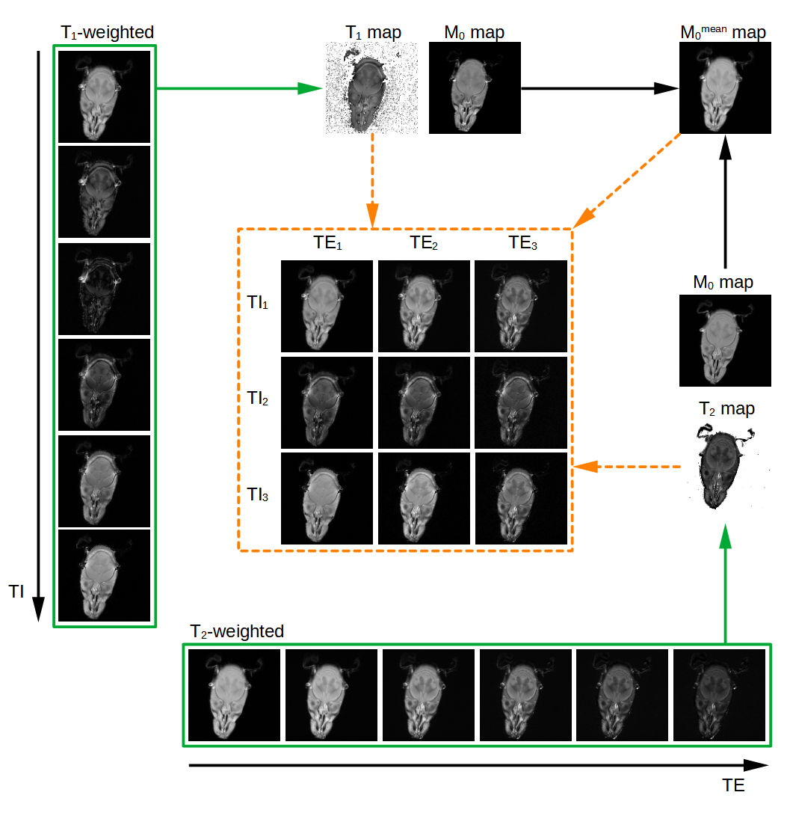

# TIandTE_wish
Calculating theoretical MRI images with both inversion time (TI; T1-weighting) and echo time (TE; T2-weighting) of choice, from separate T1-weighted and T2-weighted sets of images. This functionality can be used to visualise how inversion recovery images would look like if TEmin could be shorter or how the images' contrast will change after TE increase (e.g. due to larger image matrix). Works with Agilent SEMS (with IR) and MEMS .fid data acquired for the same slices and matrice size.

The user provides the data folders locations, lists of corresponding slices and lists of desired TI and TE values. If the TI and TE lists are empty, only the parametric maps are calculated. The script automatically imports the data with all the parameters needed and performs computations. The user can change the value of glob_var parameter to save the maps and/or the images in global Python variable for further use (instead of just saving the image files). 

## The repository contains:
1. Python script **TIandTE_wish.py**.
2. Sample FID data in **sems_20190407_07.fid** and **mems_20190406_01.fid** folders.
3. Sample results in **Theoretical_MRI** folder.
4. Graphical abstract **graph_abstr_TIandTE.png**.

## References 

**1. Collection of the sample data:**

Beata Wereszczyńska, ***Alcohol-fixed specimens for high-contrast post-mortem MRI***, Forensic Imaging, Volume 25, 2021, 200449, ISSN 2666-2256, https://doi.org/10.1016/j.fri.2021.200449. (https://www.sciencedirect.com/science/article/pii/S2666225621000208)

**2. The code:**

Beata Wereszczyńska, ***TI_TE_wish*** (https://github.com/BeataWereszczynska/TI_TE_wish)

## License
The software is licensed under the **MIT license**. The non-software content of this project is licensed under the **Creative Commons Attribution 4.0 International license**. See the LICENSE file for license rights and limitations.

## You may also like

**TI_TE_wish** - Calculating theoretical T1-weighted MRI images with arbitrary value of inversion time (TI) based on previously acquired spin echo multi-slice experiment with inversion recovery (SEMS-IR) data. Calculating theoretical T2-weighted MRI images with arbitrary value of echo time (TE) based on previously acquired multi-echo multi-slice (MEMS) data. The script can also be used for calculating T1, T2 and M0 maps without calculating theoretical images. Data import suitable for Agilent FID files, (https://github.com/BeataWereszczynska/TI_TE_wish).

**T1wIR_to_T1wSR** - Calculating T1-weighted saturation recovery (SR) MRI images for arbitrary values of repetition time (TR) from a set of T1-weighted inversion recovery (IR) experimental MRI images. The script can also be used for calculating T1 and M0 maps without calculating theoretical images. Works with Agilent .fid data (https://github.com/BeataWereszczynska/T1wIR_to_T1wSR).

**MRI_k-space-derived_details_edges** - k-space based details/edges detection in MRI images with optional k-space based denoising and detail control
(data import suitable for Agilent FID files, three binarization methods to choose from), https://doi.org/10.5281/zenodo.7388435 (https://github.com/BeataWereszczynska/MRI_k-space-derived_details_edges).

**Swelling_tablet_fronts_D_k_from_MRI_T2_or_img** - Tool for characterizing the swelling of tablets immersed in a solution. Creates time plots and calculates eroding front's diffusion rate D and the rate of the swelling k from time series of either T2-maps or (properly contrasted, e.g. T2-weighted) MRI images in FDF (file format native for Agilent MRI scanners) or Text Image format. This software is suitable for swelling matrix tablets forming a membrane-like structure in contact with the solution in which they are immersed, https://doi.org/10.5281/zenodo.7262466 (https://github.com/BeataWereszczynska/Swelling_tablet_fronts_D_k_from_MRI_T2_or_img).
